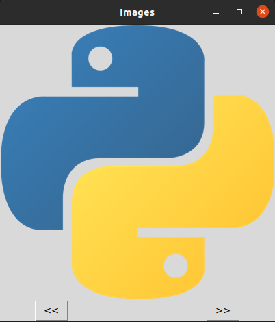

# Image Viewer-Python
A simple GUI version Python Image Viewer.
 
### Languages & tools :
[][py]
[][py]
  

|Image Viewer V0.1 |
|------|
||

### Directory Structure :     
    |-- ImageViewer_v0.1
    |   |-- Main.py
    |
    |-- Img
    |   |-- vscode.png
    |   |-- python.png
    |   |-- pycharm.png
    |   |-- ImageViewer_v0.1.png
    |
    |-- README.md

## Connect with me:  

  
 

[website]: https://abhilashtuofficial.github.io/
[py]: https://github.com/AbhilashTUofficial/ImageViewer-Python
